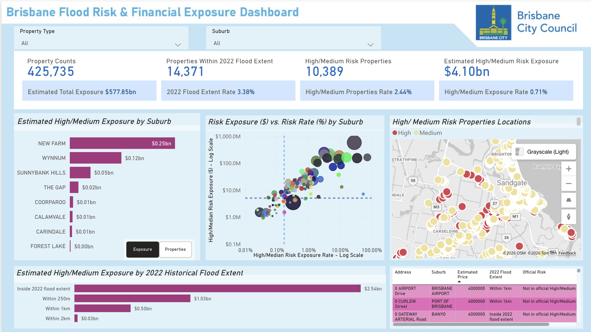
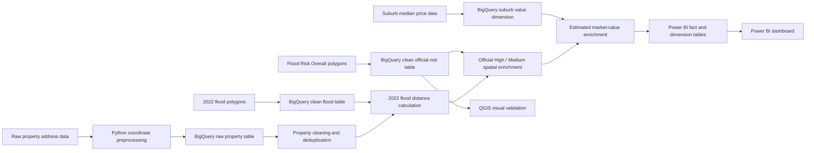

# Brisbane Property Flood Risk & Financial Exposure Analytics

## Overview

This project builds a property-level flood exposure analytics pipeline for Brisbane using Python, Google BigQuery GIS, QGIS and Power BI.

The objective is to identify current property locations exposed to flood risk, measure their proximity to the February 2022 historical flood extent, and estimate the potential market-value exposure associated with properties located in official High and Medium flood-risk areas.

The final output is an interactive Power BI dashboard designed to support portfolio-level risk monitoring and property-level investigation.



---

## Business Questions

The dashboard is designed to answer the following questions:

* How many current Brisbane properties are located within official High or Medium flood-risk areas?
* Which suburbs have the highest estimated market-value exposure?
* How many properties fall within the February 2022 historical flood extent?
* Which suburbs combine a high concentration of flood-risk properties with high financial exposure?
* Which individual property addresses require further investigation?

---

## Dashboard Highlights

The Power BI dashboard provides:

* Portfolio-level KPI cards
* Property type and suburb slicers
* Top-suburb ranking by estimated High / Medium market-value exposure
* A suburb risk concentration matrix
* A property-level Azure Maps explorer
* Historical 2022 flood-proximity analysis
* A detailed address-level investigation table

### Current Portfolio Snapshot

| Metric                                              |     Value |
| --------------------------------------------------- | --------: |
| Total properties assessed                           |   425,735 |
| Properties within the 2022 flood extent             |    14,371 |
| Properties within official High / Medium risk areas |    10,389 |
| Estimated total portfolio market value              | $577.85bn |
| Estimated High / Medium market-value exposure       |   $4.10bn |
| 2022 flood extent rate                              |     3.38% |
| High / Medium property rate                         |     2.44% |
| High / Medium value exposure rate                   |     0.71% |

> These values are indicative analytical outputs based on the current processed dataset and may change when source data is refreshed.

---

## Data Sources

### 1. Property Address Locations

Current Brisbane property address point records were used as the portfolio base.

Key fields include:

* Property ID
* Full address
* Suburb
* Postcode
* Easting
* Northing
* Address unit number
* Property description

The source coordinates were provided in a projected coordinate reference system and converted to latitude and longitude before loading into BigQuery.

### 2. February 2022 Historical Flood Extent

Historical flood polygons were used to calculate:

* Whether a property point fell within the 2022 flood extent
* Distance from each property point to the nearest 2022 flood polygon
* Historical proximity bands

### 3. Flood Risk Overall

The Brisbane City Council Flood Risk Overall polygon layer was used as the official long-term flood-risk enrichment source.

The dashboard currently focuses on official High and Medium risk areas.

### 4. Suburb-Level Property Price Data

Suburb-level house and unit median prices were used as indicative market-value proxies.

These values do **not** represent:

* Policy-level sum insured
* Building replacement cost
* Property-specific valuations
* Insurance premiums

They are used only to estimate potential market-value exposure at portfolio level.

---

## Architecture



---

## Data Pipeline

### 1. Coordinate Preprocessing in Python

The property source contained `EASTING` and `NORTHING` values rather than latitude and longitude.

Python and `pyproj` were used to convert projected coordinates into WGS 84 coordinates:

```python
from pyproj import Transformer

transformer = Transformer.from_crs(
    "EPSG:7856",
    "EPSG:4326",
    always_xy=True
)

longitude, latitude = transformer.transform(easting, northing)
```

Records with missing or malformed coordinates were isolated before transformation to prevent invalid spatial values from entering the analytical tables.

### 2. Property Cleaning in BigQuery

BigQuery SQL was used to:

* Remove invalid latitude and longitude records
* Standardise suburb and postcode values
* Deduplicate property IDs
* Prioritise official address locations where duplicate property records existed
* Generate reusable `GEOGRAPHY` point fields

Example:

```sql
ST_GEOGPOINT(longitude, latitude) AS property_geog
```

### 3. Historical Flood Distance Calculation

Each property point was matched to the nearest February 2022 flood polygon within a 2 km search radius.

Example:

```sql
ST_DWITHIN(property_geog, flood_geog, 2000)
```

The final output includes:

* `distance_to_2022_flood_m`
* `is_in_2022_flood_area`
* `flood_2022_distance_band`

The historical proximity bands are:

| Distance band            | Meaning                                                  |
| ------------------------ | -------------------------------------------------------- |
| Inside 2022 flood extent | Property point falls within the historical flood polygon |
| Within 250m              | Property is close to the historical flood extent         |
| Within 1km               | Property is within 1 km of the historical flood extent   |
| Within 2km               | Property is within 2 km of the historical flood extent   |
| Outside 2km              | No flood polygon was matched within the search radius    |

### 4. Official Flood Risk Spatial Enrichment

The Flood Risk Overall layer contains a large number of polygons. A direct full-table point-in-polygon join exceeded BigQuery on-demand CPU limits.

To improve performance, the spatial enrichment was decomposed into staged joins:

1. Filter polygons by risk band
2. Calculate a bounding box for each polygon
3. Apply bounding-box pre-filtering
4. Run exact `ST_INTERSECTS` checks only on candidate property-polygon pairs
5. Materialise intermediate results
6. Prioritise High risk before Medium risk

Example:

```sql
ON p.longitude BETWEEN f.min_lon AND f.max_lon
AND p.latitude BETWEEN f.min_lat AND f.max_lat
AND ST_INTERSECTS(p.property_geog, f.flood_overall_geog)
```

This approach significantly reduced unnecessary geometry calculations.

### 5. Estimated Market-Value Exposure

Suburb-level house and unit median values were mapped to property records.

A property-type proxy was derived using address-level indicators, including whether a unit number was present.

```sql
CASE
  WHEN unit_number IS NOT NULL
       AND TRIM(CAST(unit_number AS STRING)) != ''
    THEN 'unit'
  ELSE 'house'
END AS property_type
```

The estimated market value for each property was then assigned using the corresponding suburb-level median value.

```sql
CASE
  WHEN property_type = 'unit'
    THEN unit_median_price
  ELSE house_median_price
END AS estimated_market_value
```

The estimated High / Medium market-value exposure is calculated as:

```text
Sum of estimated market values
for properties located in official High or Medium flood-risk areas
```

---

## Data Model

The Power BI semantic model uses a lightweight star-style structure.

### Fact Table

`fact_property_risk`

Key fields:

* `property_id`
* `full_address`
* `suburb`
* `latitude`
* `longitude`
* `property_type`
* `distance_to_2022_flood_m`
* `flood_2022_distance_band`
* `is_in_2022_flood_area`
* `official_overall_flood_risk_band`
* `estimated_market_value`
* `estimated_high_medium_exposure_value`

### Dimension Tables

`dim_2022_distance_band`

| Band                     | Sort order |
| ------------------------ | ---------: |
| Inside 2022 flood extent |          1 |
| Within 250m              |          2 |
| Within 1km               |          3 |
| Within 2km               |          4 |
| Outside 2km              |          5 |

`dim_risk`

| Official risk band          | Sort order |
| --------------------------- | ---------: |
| High                        |          1 |
| Medium                      |          2 |
| Not mapped as High / Medium |          3 |

---

## Power BI Measures

Example measures:

```DAX
Total Properties =
DISTINCTCOUNT(fact_property_risk[property_id])
```

```DAX
High Medium Risk Properties =
CALCULATE(
    DISTINCTCOUNT(fact_property_risk[property_id]),
    fact_property_risk[official_overall_flood_risk_band]
        IN { "High", "Medium" }
)
```

```DAX
High Medium Property Rate =
DIVIDE(
    [High Medium Risk Properties],
    [Total Properties]
)
```

```DAX
Estimated Total Portfolio Value =
SUM(fact_property_risk[estimated_market_value])
```

```DAX
Estimated High Medium Risk Exposure =
SUM(fact_property_risk[estimated_high_medium_exposure_value])
```

```DAX
High Medium Value Exposure Rate =
DIVIDE(
    [Estimated High Medium Risk Exposure],
    [Estimated Total Portfolio Value]
)
```

---

## QGIS Validation

QGIS was used to visually validate the spatial alignment between:

* Brisbane property address points
* Flood Risk Overall polygons
* Historical flood-related layers

The visual inspection confirmed that:

* Property points aligned correctly with Brisbane suburbs
* Flood-risk polygons followed river, creek and low-lying corridors
* High and Medium zones were spatially concentrated around mapped waterways
* Property-level intersections appeared consistent with the underlying geography


---

## Technical Challenges and Optimisation

### Challenge 1: Projected Coordinates

The source property data contained Easting and Northing coordinates rather than latitude and longitude.

**Solution:**
Use Python and `pyproj` to convert coordinates before loading them into BigQuery.

### Challenge 2: Duplicate Property Records

Some property IDs appeared multiple times with different address-use types.

**Solution:**
Use `ROW_NUMBER()` with prioritisation rules to retain one official property record per ID.

### Challenge 3: Large-Scale Spatial Join

The official Flood Risk Overall layer contained a large number of polygons. A direct point-in-polygon join exceeded the BigQuery on-demand CPU ratio limit.

**Solution:**

* Materialise cleaned geography tables
* Split spatial processing by risk band
* Add bounding-box pre-filtering
* Run exact geometry checks only on candidate pairs
* Materialise intermediate results before final enrichment

### Challenge 4: Property Value Estimation

The source data did not contain property-specific valuations or authoritative dwelling-type classifications.

**Solution:**
Use suburb-level median values and an address-based house/unit proxy for indicative exposure estimation.

---

## Assumptions and Limitations

* Estimated market values are suburb-level proxies rather than property-specific valuations.
* Estimated values are not equivalent to insured values or reconstruction costs.
* Property type is approximated using address-level indicators and is not an authoritative dwelling classification.
* A point-based exposure model may not capture the full footprint of large parcels or buildings.
* Historical 2022 flood proximity is a scenario-based metric and should not be interpreted as a long-term flood probability.
* Properties not mapped as High or Medium risk should not automatically be interpreted as risk-free.

---

## Technology Stack

| Area               | Tools                  |
| ------------------ | ---------------------- |
| Data preprocessing | Python, pandas, pyproj |
| Data warehouse     | Google BigQuery        |
| Spatial analysis   | BigQuery GIS, QGIS     |
| Visualisation      | Power BI, Azure Maps   |
| Modelling          | SQL, DAX               |
| Version control    | Git, GitHub            |

---

## Future Improvements

Potential future extensions include:

* Integrating building replacement-cost estimates rather than market-value proxies
* Adding Low and Very Low official flood-risk bands
* Adding property boundary polygons for parcel-level exposure analysis
* Implementing S2 or H3-style spatial partitioning for larger-scale spatial joins
* Incorporating additional hazard layers such as bushfire, storm tide or overland flow
* Adding scheduled data refresh and automated pipeline orchestration

---

## Author

Built as a portfolio project to demonstrate geospatial ELT, BigQuery GIS optimisation, dimensional modelling and Power BI dashboard design.

## Live Dashboard

https://app.powerbi.com/view?r=eyJrIjoiYzRiMThjYWMtMGExYS00MmNmLWIzMTgtODU4M2RjMzE2YWI4IiwidCI6IjYwZDIwZjk2LTNmYWMtNDdjMy04N2FmLTE3MDE4MDNhYWJlMyJ9
